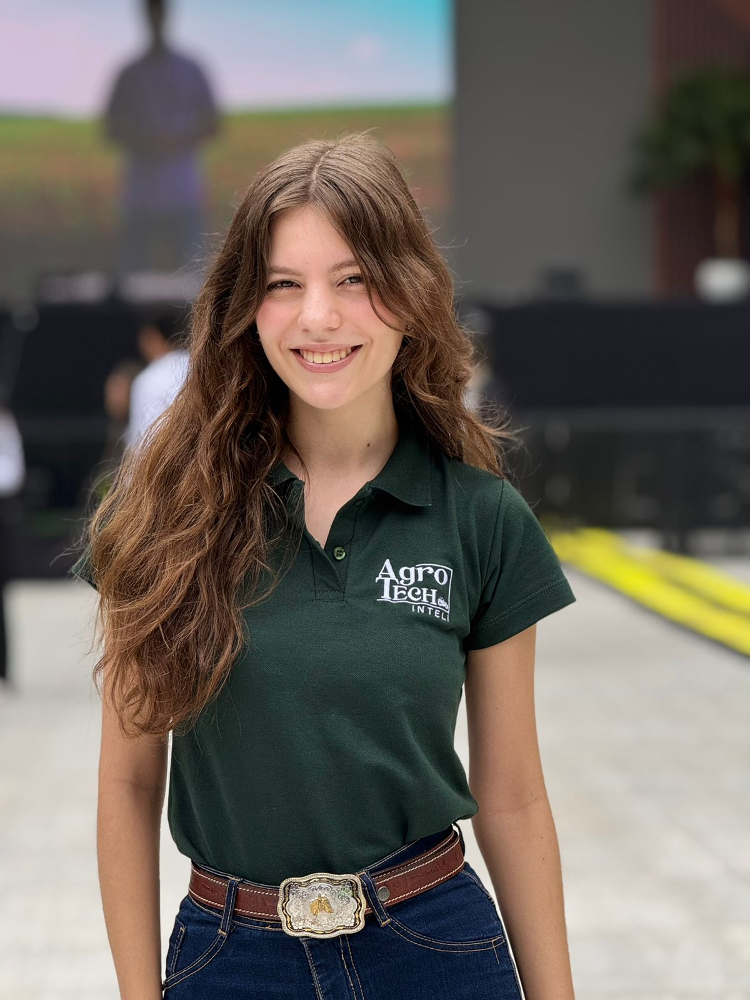

# ⚖️ Projeto LexCarf

Sistema de predição de resultados do CARF utilizando machine learning, com modelos treinados em dados de 2023 e validados em dados de 2024, visando garantir ausência de vazamento de informação.

## 🏆 Equipe


<div align="left">
  <table>
    <tr >
     <td><b>Analistas de domínio:</b></td>
  <td align="center"><a href="https://www.linkedin.com/in/vicky-auricchio-saes-0a496a243/"><br><sub><b>Vicky Auricchio</b><br>Direito, 
  FGV</sub></a></td>
  <td align="center"><a href="https://www.linkedin.com/in/lavinia-mendonca/"><br><sub><b>Lavínia Mendonça</b><br>Administração Tecnológica, 
  Inteli</sub></a></td>
  
<div align="left">
  <table>
    <tr>
      <td><b>Analistas de dados:</b></td>
      <td align="center"><a href="https://www.linkedin.com/in/carlosicaro"><br><sub><b>Carlos Icaro</b><br>Eng. da Computação, Inteli</sub></a></td>
      <td align="center"><a href="https://www.linkedin.com/in/amandadarosa/"><br><sub><b>Amanda Cristina</b><br>Eng. da Computação, Inteli</sub></a></td>
    </tr>
  </table>
</div>


## 🎯 Objetivos

### 1. **Probabilidade de Provimento**
- **Provido Total**: Recurso totalmente aceito
- **Negado**: Recurso rejeitado

### 2. **Tipo de Votação** (apenas para provimentos)
- **Unânime**: Todos os conselheiros concordam
- **Maioria**: Maioria dos conselheiros concorda  
- **Qualidade**: Decisão por voto de qualidade do presidente
- **Empate**: Empate (Lei 13.988/2020)

## 🚀 Execução Rápida

### **Opção 1: Execução Principal (Recomendada)**
```bash
python run.py
```

### **Opção 2: Execução Direta**
```bash
python -m streamlit run aplicacoes/app_2023_2024.py
```

### **Opção 3: Demonstração em Linha de Comando**
```bash
python aplicacoes/demo_2023_2024.py
```

**Acesse:** http://localhost:8501

## 📊 Performance dos Modelos

### **Modelo de Provimento:**
- **Acurácia**: 75% (teste real com dados 2024)
- **Precision**: Negado (66%), Provido Total (86%)
- **Recall**: Negado (86%), Provido Total (66%)

### **Modelo de Votação:**
- **Acurácia**: 87% (teste real com dados 2024)
- **Precision**: Unânime (91%), Maioria (23%)
- **Recall**: Unânime (96%), Maioria (13%)

## 📁 Estrutura do Projeto

```
HackathonCarf/
├── 📱 aplicacoes/           # Aplicações e interfaces
│   ├── app_2023_2024.py     # Aplicação principal (sem vazamento)
│   ├── demo_2023_2024.py    # Demonstração em linha de comando
│   └── executar_plataforma.py
├── 🤖 modelos/              # Modelos treinados
│   ├── modelo_carf_provimento_2023.pkl
│   ├── modelo_carf_votacao_2023.pkl
│   └── preprocessors_2023.pkl
├── 📊 dados/                # Datasets
│   ├── carf_2023_sem_vazamento.csv
│   ├── carf_sem_vazamento.csv
│   └── carf_julgamentos_2024.csv
├── 🔧 scripts/              # Scripts de análise e processamento
│   ├── analise_2023.py
│   ├── detectar_vazamento_2023.py
│   └── verificar_dataset_limpo.py
├── 📚 notebooks/            # Notebooks de desenvolvimento
│   └── train_model_2023_2024.py
├── 📖 documentacao/         # Documentação
│   ├── COMO_EXECUTAR.md
│   ├── RESUMO_2023_2024.md
│   └── ANALISE_VAZAMENTO.md
├── 🎨 assets/               # Recursos visuais
├── 📋 requirements.txt      # Dependências
└── 🚀 run.py               # Execução principal
```

## 🔧 Tecnologias Utilizadas

- **Python 3.8+**
- **Scikit-learn**: Machine Learning
- **Streamlit**: Interface Web
- **Pandas**: Manipulação de Dados
- **TF-IDF**: Processamento de Texto
- **Random Forest**: Algoritmo de ML

## 📈 Dados Processados

### **Treinamento (2023):**
- **Total**: 21.605 registros
- **Após limpeza**: 13.470 registros (62.3%)
- **Vazamento removido**: 8.135 registros (37.7%)

### **Teste (2024):**
- **Total**: 25.870 registros
- **Após limpeza**: 16.066 registros (62.1%)
- **Vazamento removido**: 9.804 registros (37.9%)

## 💡 Exemplos de Resultados

### **Exemplo 1: IRPF**
- **Provimento**: Negado (53.5%) ❌
- **Votação**: Unânime (84.3%) (não aplicável)

### **Exemplo 2: COFINS**  
- **Provimento**: Provido Total (53.8%) ✅
- **Votação**: Maioria (49.9%) 🗳️
- **Confiança combinada**: 51.8%

### **Exemplo 3: IRPJ**
- **Provimento**: Negado (62.7%) ❌
- **Votação**: Unânime (74.1%) (não aplicável)

## 🎯 Interface Web

A aplicação web oferece:
- ✅ **Duas dimensões**: Provimento + Tipo de Votação
- ✅ **Métricas visuais**: Probabilidades em formato de métricas
- ✅ **Resumo combinado**: Resultado esperado com confiança
- ✅ **Exemplos pré-definidos**: Para teste rápido
- ✅ **Design responsivo**: Interface moderna e intuitiva

## 🆘 Solução de Problemas

### **Se der erro "streamlit não encontrado":**
```bash
pip install streamlit
```

### **Se der erro "modelo não encontrado":**
```bash
cd notebooks
python train_model_2023_2024.py
cd ..
```

### **Se der erro de porta ocupada:**
```bash
python -m streamlit run aplicacoes/app_2023_2024.py --server.port 8502
```

## 📚 Documentação

- **[Como Executar](documentacao/COMO_EXECUTAR.md)**: Instruções detalhadas
- **[Resumo 2023/2024](documentacao/RESUMO_2023_2024.md)**: Resumo completo do projeto
- **[Análise de Vazamento](documentacao/ANALISE_VAZAMENTO.md)**: Detalhes sobre detecção de vazamento

---

**🎉 Projeto desenvolvido para o Hackathon CARF 2024**

Sistema de machine learning para predição de resultados do CARF, com modelos treinados em dados de 2023 e validados em dados de 2024, garantindo alta qualidade e ausência de vazamento de informação.